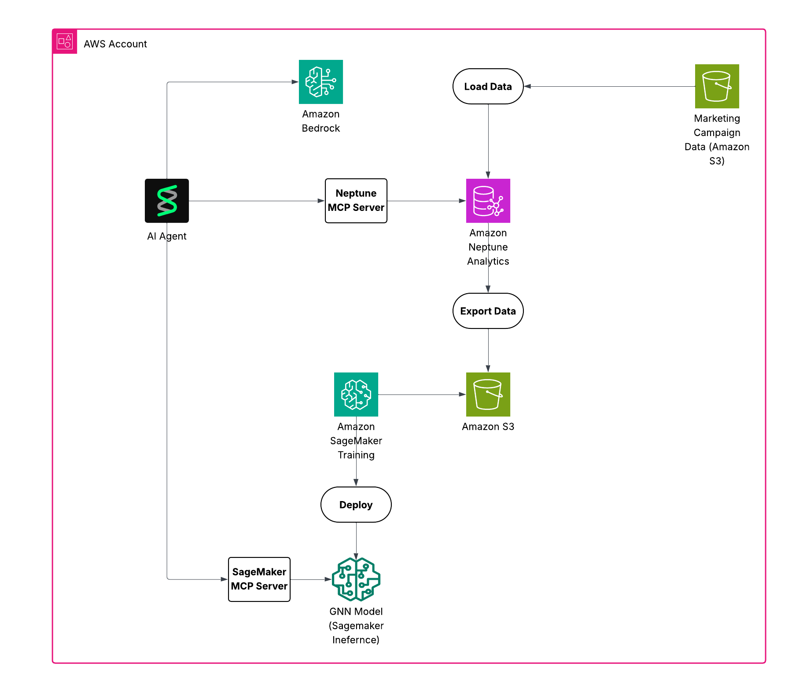

# HCP Digital Campaign Analytics

A comprehensive solution for analyzing Healthcare Professional (HCP) digital campaign data using Neptune Analytics graph database and machine learning. This project transforms pharmaceutical marketing data into actionable insights through graph neural networks.

## 🎯 Overview

This project enables pharmaceutical companies to:
- **Analyze HCP engagement patterns** with digital marketing campaigns
- **Predict campaign effectiveness** using graph neural networks
- **Generate personalized recommendations** for healthcare professionals
- **Visualize complex relationships** between HCPs, campaigns, and therapeutic areas

## 🏗️ Architecture

```
┌─────────────────┐    ┌──────────────────┐    ┌─────────────────┐
│   CSV Data      │───▶│  Neptune Graph   │───▶│  SageMaker ML   │
│  (Campaign      │    │   Analytics      │    │   Training      │
│   Activity)     │    │                  │    │                 │
└─────────────────┘    └──────────────────┘    └─────────────────┘
                                │                        │
                                ▼                        ▼
                       ┌──────────────────┐    ┌─────────────────┐
                       │   S3 Storage     │    │   Inference     │
                       │  (Encrypted)     │    │   Endpoint      │
                       └──────────────────┘    └─────────────────┘
```



## 📋 Prerequisites

- **Python 3.11+**
- **AWS CLI** configured with appropriate permissions
- **uv** package manager ([installation guide](https://docs.astral.sh/uv/getting-started/installation/))
- **AWS CDK** (installed via uv)

## 🚀 Installation & Setup

### 1. Clone and Setup Project

```bash
# Clone the repository
git clone <repository-url>
cd HCP-digital-campaign-agents

# Install dependencies with uv
uv sync
```

### 2. Configure AWS Environment

```bash
# Set your AWS region
export AWS_DEFAULT_REGION=<region>

# Export other AWS configurations if needed
#export AWS_ACCESS_KEY_ID=<your-access-key-id>
#export AWS_SECRET_ACCESS_KEY=<your-secret-access-key>

# Verify AWS configuration
aws sts get-caller-identity
```

### 3. Deploy Infrastructure

```bash
# Bootstrap CDK (first time only)
uv run cdk bootstrap --app "python infra/app.py"

# Deploy the Neptune Analytics stack
uv run cdk deploy --app "python infra/app.py"
```

**📝 Save the CDK outputs for data loading:**

After deployment, note these values from the CDK output:
- `GraphId`: Neptune Analytics Graph ID (e.g., `g-jdct09zc09`)
- `GraphArn`: Neptune Analytics Graph ARN  
- `DataBucketName`: S3 bucket for data storage (e.g., `hcp-campaign-neptune-data-709753484661`)
- `NeptuneRoleArn`: Role for Neptune import tasks (e.g., `arn:aws:iam::709753484661:role/HCPCampaignStack-HCPCampaignNeptuneRole96C57B9F-QMAPmT0m6aQL`)
- `SageMakerRoleArn`: Role for ML training jobs
- `KMSKeyArn`: Encryption key for data security

**💡 Tip:** You can retrieve these values anytime with:
```bash
uv run cdk deploy --app "python infra/app.py" --outputs-file cdk-outputs.json
```

## 📊 Data Processing Pipeline

### 1. Load Campaign Data to Neptune

After deploying the CDK stack, use the output values to load your campaign data:

```bash
# Load HCP campaign data into Neptune Analytics
uv run python scripts/neptune_data_loader.py \
  --region "us-east-1" \
  --s3-bucket "<DataBucketName from CDK output>" \
  --s3-prefix "neptune/hcp_marketing/" \
  --role-arn "<NeptuneRoleArn from CDK output>" \
  --graph-id "<GraphId from CDK output>"
```

**Example with actual values:**
```bash
uv run python scripts/neptune_data_loader.py \
  --region "us-east-1" \
  --s3-bucket "hcp-campaign-neptune-data-709753484661" \
  --s3-prefix "neptune/hcp_marketing/" \
  --role-arn "arn:aws:iam::709753484661:role/HCPCampaignStack-HCPCampaignNeptuneRole96C57B9F-QMAPmT0m6aQL" \
  --graph-id "g-jdct09zc09"
```

This script:
- **Transforms** CSV data to Neptune graph format
- **Creates** graph nodes and edges:
  - **Nodes**: HCPs, Campaigns, Content, Brands, Therapeutic Areas
  - **Edges**: Engagement relationships with activity metadata
- **Uploads** processed data to S3
- **Initiates** Neptune import task

### 2. Verify Data Load

```bash
# Verify the data was loaded successfully
uv run python scripts/verify_data_load.py \
  --region "us-east-1" \
  --graph-id "<GraphId from CDK output>"
```

**Example with actual values:**
```bash
uv run python scripts/verify_data_load.py \
  --region "us-east-1" \
  --graph-id "g-jdct09zc09"
```

This verification script will show:
- **Sample HCP nodes** from the graph
- **Node counts by type** (HCP, Campaign, Tactic, etc.)
- **Total edge count** for relationships
- **Sample engagement relationships** between HCPs and tactics

### 3. Interactive Campaign Analytics

Query and analyze your HCP campaign data interactively using the AI-powered analytics agent:

```bash
# Start the interactive HCP campaign analytics tool
uv run python scripts/hcp_campaign_query_agent.py \
  --neptune-endpoint "<GraphId from CDK output>" \
  --region "us-east-1"
```

**Example with actual values:**
```bash
uv run python scripts/hcp_campaign_query_agent.py \
  --neptune-endpoint "g-jdct09zc09" \
  --region "us-east-1"
```

**Sample queries you can ask:**
- "Which HCPs have the highest engagement rates?"
- "What are the most effective campaign tactics?"
- "Show me engagement patterns by therapeutic area"
- "Which channels drive the most HCP interactions?"
- "Find HCPs who engaged with diabetes campaigns"
- "What content generates the most engagement?"

The agent uses:
- **Neptune MCP Server** for graph database queries
- **Claude 3.5 Sonnet** for intelligent analysis
- **Interactive CLI** for real-time exploration

### 4. Export Data for ML Training

```bash
# Export graph data from Neptune Analytics
uv run python scripts/model-training/1.data_export.py \
  --region "us-east-1" \
  --s3-bucket "<DataBucketName from CDK output>" \
  --s3-prefix "neptune/hcp_marketing-exported/" \
  --role-arn "<NeptuneRoleArn from CDK output>" \
  --graph-id "<GraphId from CDK output>" \
  --kms-key-arn "<KMSKeyArn from CDK output>"
```

**Example with actual values:**
```bash
uv run python scripts/model-training/1.data_export.py \
  --region "us-east-1" \
  --s3-bucket "hcp-campaign-neptune-data-709753484661" \
  --s3-prefix "neptune/hcp_marketing-exported/" \
  --role-arn "arn:aws:iam::709753484661:role/HCPCampaignStack-HCPCampaignNeptuneRole96C57B9F-QMAPmT0m6aQL" \
  --graph-id "g-jdct09zc09" \
  --kms-key-arn "arn:aws:kms:us-east-1:709753484661:key/2510e373-48df-424e-8ad4-1e8384a411dc"
```

### 5. Prepare Training Data

```bash
# Process exported data for ML training
uv run python scripts/model-training/2.data_prepation_for_training.py \
  --bucket "<DataBucketName from CDK output>" \
  --export-prefix "neptune/hcp_marketing-exported/<export-task-id>/" \
  --processed-prefix "graph-processed/hcp/"
```

**Example with actual values:**
```bash
uv run python scripts/model-training/2.data_prepation_for_training.py \
  --bucket "hcp-campaign-neptune-data-709753484661" \
  --export-prefix "neptune/hcp_marketing-exported/t-6ka1g84iga/" \
  --processed-prefix "graph-processed/hcp/"
```

## 🤖 Machine Learning Pipeline

### 1. Train Graph Neural Network

```bash
# Train link prediction model on SageMaker
uv run python scripts/model-training/3.sm_training.py \
  --region "us-east-1" \
  --role-arn "<SageMakerRoleArn from CDK output>" \
  --s3-data-path "s3://<DataBucketName>/graph-processed/hcp/" \
  --instance-type "ml.g5.2xlarge" \
  --epochs 3 \
  --hidden-dim 128
```

**Example with actual values:**
```bash
uv run python scripts/model-training/3.sm_training.py \
  --region "us-east-1" \
  --role-arn "arn:aws:iam::709753484661:role/HCPCampaignStack-HCPCampaignSageMakerRole35E854E3-JUxrTwp1BLx4" \
  --s3-data-path "s3://hcp-campaign-neptune-data-709753484661/graph-processed/hcp/" \
  --instance-type "ml.g5.2xlarge" \
  --epochs 3 \
  --hidden-dim 128
```

**Training Configuration:**
- **Instance**: `ml.g5.2xlarge` (GPU-enabled)
- **Framework**: PyTorch 2.2 with DGL
- **Model**: Graph SAGE for link prediction
- **Output**: Trained embeddings for HCPs and tactics

### 2. Deploy Model for Inference

```bash
# Deploy trained model to SageMaker endpoint
uv run python scripts/model-training/4.deploy_model.py \
  --model-url "<model_s3_url_from_training_output>" \
  --region "us-east-1" \
  --role-arn "<SageMakerRoleArn from CDK output>" \
  --endpoint-name "hcp-campaign-model-endpoint" \
  --instance-type "ml.m5.large" \
  --test
```

**Example with actual values:**
```bash
uv run python scripts/model-training/4.deploy_model.py \
  --model-url "s3://sagemaker-us-east-1-709753484661/pytorch-training-2025-08-31-19-56-16-265/output/model.tar.gz" \
  --region "us-east-1" \
  --role-arn "arn:aws:iam::709753484661:role/HCPCampaignStack-HCPCampaignSageMakerRole35E854E3-JUxrTwp1BLx4" \
  --endpoint-name "hcp-campaign-model-endpoint" \
  --instance-type "ml.m5.large" \
  --test
```

### 3. Cleanup Endpoint

**Delete endpoint when done to avoid charges:**
```bash
# Delete a specific endpoint
uv run python scripts/model-training/5.cleanup_endpoint.py \
  --endpoint-name "hcp-campaign-model-endpoint" \
  --region "us-east-1"
```

**List all endpoints:**
```bash
# List all endpoints in the region
uv run python scripts/model-training/5.cleanup_endpoint.py \
  --list \
  --region "us-east-1"

# Filter endpoints by name pattern
uv run python scripts/model-training/5.cleanup_endpoint.py \
  --list \
  --filter "hcp-campaign" \
  --region "us-east-1"
```

## 🔧 Infrastructure Components

### Neptune Analytics Graph
- **Purpose**: Store and query HCP campaign relationships
- **Features**: Vector search, SPARQL queries, graph algorithms
- **Encryption**: KMS-encrypted with dedicated key

### S3 Data Storage
- **Bucket**: `hcp-campaign-neptune-data-{account-id}`
- **Contents**: Raw CSV, processed graph data, ML artifacts
- **Security**: Private access, KMS encryption

### SageMaker Components
- **Training Jobs**: GPU instances for graph neural network training
- **Inference Endpoints**: Real-time prediction API
- **Roles**: Proper IAM permissions for Neptune and S3 access

### KMS Encryption
- **Key Usage**: Neptune exports, S3 storage, SageMaker artifacts
- **Permissions**: Scoped to Neptune-specific encryption contexts

## 📡 API Usage

### Prediction Endpoint

**Request:**
```json
{
  "hcp_ids": [0, 1, 2],
  "tactic_ids": [0, 1, 2, 3]
}
```

**Response:**
```json
{
  "hcp_ids": [0, 1, 2],
  "tactic_ids": [0, 1, 2, 3],
  "engagement_probabilities": [[0.8, 0.6, 0.4, 0.2], ...],
  "top_recommendations": [
    {
      "hcp_id": 0,
      "recommended_tactics": [
        {"tactic_id": 0, "engagement_probability": 0.8},
        {"tactic_id": 1, "engagement_probability": 0.6}
      ]
    }
  ],
  "model_info": {
    "num_hcps": 1000,
    "num_tactics": 100,
    "embedding_dim": 64
  }
}
```

## 🗂️ Project Structure

```
drug-digital-campaign/
├── data/                           # Raw campaign data
│   └── 10_HCP_Sample_Data_Digital_Cpgn_Act.csv
├── infra/                          # AWS CDK infrastructure
│   ├── app.py                      # CDK application
│   └── hcp_campaign_stack.py       # Neptune + S3 + IAM stack
├── scripts/
│   ├── transform_data.py           # CSV to graph transformation
│   └── model-training/             # ML pipeline scripts
│       ├── 1.data_export.py        # Neptune data export
│       ├── 2.data_prepation_for_training.py  # ML data prep
│       ├── 3.sm_training.py        # SageMaker training
│       ├── 4.deploy_model.py       # Model deployment
│       └── sm/                     # SageMaker code
│           ├── train_dgl_lp.py     # Training script
│           ├── inference.py        # Inference handler
│           └── requirements.txt    # ML dependencies
├── src/
│   └── data_loader.py              # Graph data processing
└── pyproject.toml                  # Project configuration
```

## 🧹 Cleanup

### Delete SageMaker Endpoint
```bash
uv run python scripts/model-training/5.cleanup_endpoint.py \
  --endpoint-name "hcp-campaign-model-endpoint" \
  --region "us-east-1"
```

### Destroy Infrastructure
```bash
uv run cdk destroy --app "python infra/app.py"
```

## 🔍 Monitoring & Troubleshooting

### CloudWatch Logs
- **Training Jobs**: `/aws/sagemaker/TrainingJobs/{job-name}`
- **Endpoints**: `/aws/sagemaker/Endpoints/{endpoint-name}`
- **Neptune**: `/aws/neptune/{cluster-id}`

### Common Issues
1. **Region Configuration**: Ensure `AWS_DEFAULT_REGION` is set
2. **IAM Permissions**: Verify SageMaker execution role has Neptune access
3. **Data Format**: Check CSV headers match expected Neptune format
4. **Model Size**: Ensure embedding dimensions match training configuration

## 📈 Performance Optimization

### Training
- Use GPU instances (`ml.g5.xlarge` or larger)
- Adjust batch size and learning rate
- Monitor loss convergence

### Inference
- Use CPU instances (`ml.m5.large`) for cost efficiency
- Implement batch prediction for multiple HCPs
- Cache frequent predictions

## 🔐 Security Best Practices

- **Encryption**: All data encrypted at rest and in transit
- **IAM**: Least privilege access principles
- **VPC**: Consider VPC endpoints for private communication
- **Monitoring**: Enable CloudTrail for audit logging

## 🤝 Contributing

1. Fork the repository
2. Create feature branch (`git checkout -b feature/amazing-feature`)
3. Commit changes (`git commit -m 'Add amazing feature'`)
4. Push to branch (`git push origin feature/amazing-feature`)
5. Open Pull Request

## 📄 License

This project is licensed under the MIT License - see the LICENSE file for details.